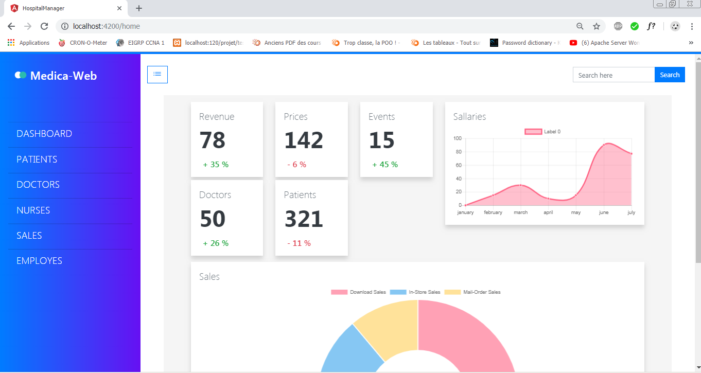
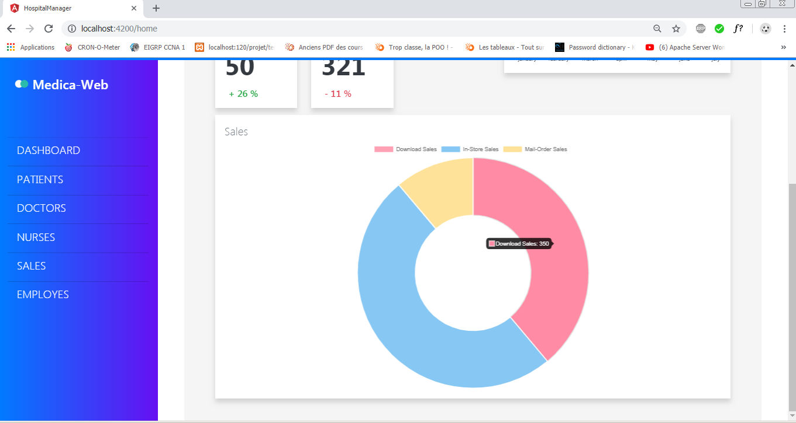
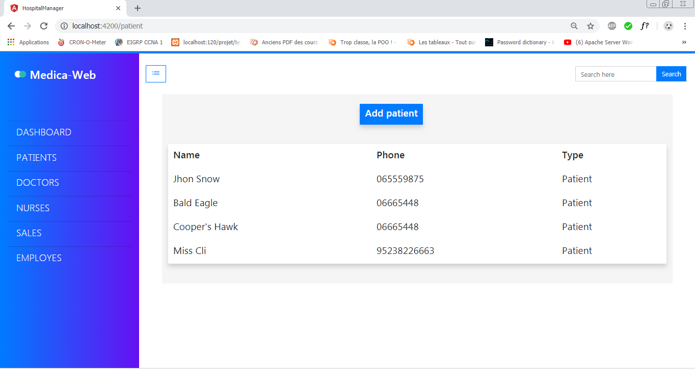

# hospital-manager

This is the front end for a hospital managment system , to run this project follow this instructions :

step-1 : clone the project

step-2 : run npm install to install all the dependencies 

step-3 : run ng serve from the root of the project , and here you go :D 

PS : you may need internet connection for better rendering (icons and fonts ) , and the application have not been tested for the small and extra large devices

Usage : 

- click on the list button on top to toggle the sidenave

- click on  dashboard to navigate to dashboard (the others are not working , i made just two to preview the routing ) 

- you can show details by hovering the charts on the dashboard

- click on patients to see the patients list  (the add patient modal doesn't add patients) 

Assessment : 

What i correctly implemented ? 

- i used angular routing module for navigation .
- i created components for more structuring code.
- i fetched Json data using the http module of angular , and the data.json file wich contain fake data.
- i used angular material for the sidenav .
- i used bootstrap and ng-bootstrap https://ng-bootstrap.github.io/#/home for styling and widgets  .
- i added charts using : chart.js library.
- all css files i used were valid in w3 plateform .

What i didn't  implemented ? 

- passing the official HTML5 specification.
- i didn't used post or delete requests since it is the same as get requests.
- i didn't used Oclazyload for the project . 
- i didn't finished the other pages since it is the same as the patient page .

How many hours i spent ? 

i spent almost : 
- 2 hours for designing the plateform .
- 8 hours of work and research. 

Screenshots:

main view:

patient view:

